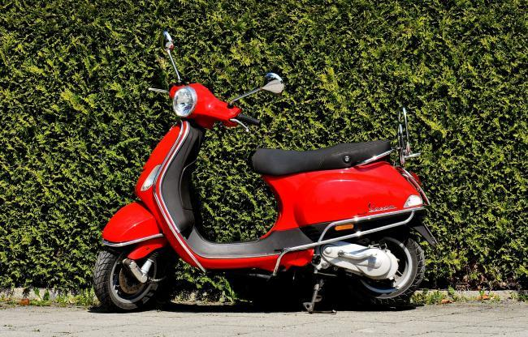

# Sri_Git
## welcome
### sri lakshmi sarva

* one
* two
* three

I sri

II geetha

III ramaya

this is ***ALIET***

# ML CODE

import numpy

import pandas

df=pd.Dataframe({"one":[1,2,3]})

df.head()

# Display image 

